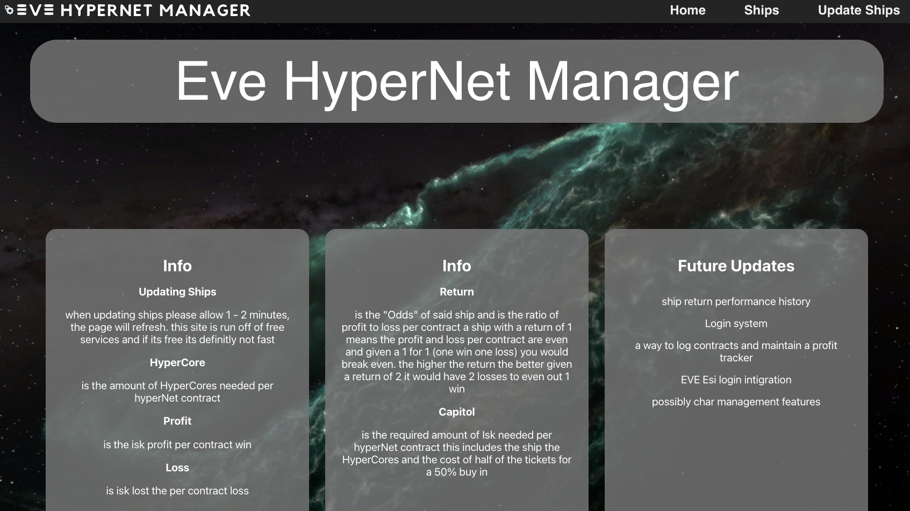
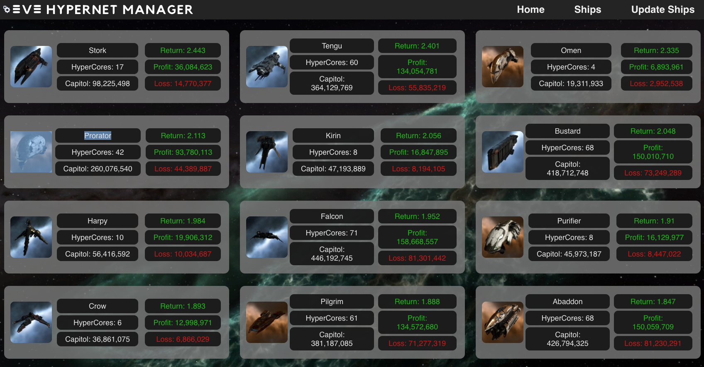

# Eve HyperNet Manager

## Date: 8/30/2021

### By: Tanner Mitchell

[Github](https://github.com/BtSquared) | [LinkedIn](https://www.linkedin.com/in/tanner-mitchell-836130152/) 

***Description***

as we all know internet spaceships is very serious business, and with serious business come serious spread sheets. I made this application to make one part of your internet space job much easier.

this application tracks Jita market data, calculates and tracks how profitable a ship is when raffled off on the HyperNet with a 50% buy in. as well as give relivent related values.

***Technologies Used***

* React.js
* Express
* mongoDB
* Mongoose

***Getting Started***

  if using the web site just click the nav bar to the ships section if you want to update the ships value then click update ships and give it 1 - 2 minutes and the page should auto refresh once its updated 

  if your running the app locally run npm install in both the client folder and the main directory. after you have installed open two seperate terminals in one run npm start in the main dicrectory then in the other run npm start in the client directory. after that you need to update the db first send a post request to http://localhost:3001/api/ships/estimatedvalue once you've done that then send a post request to http://localhost:3001/api/ships/makeships these post request require no input from your end all the data they need is recived from EVE Esi and with that you should be good to go

***Screenshots***

  
  

***future updates***

- [ ] ship return performance history
- [ ] Login system
- [ ] a way to log contracts and maintain a profit tracker
- [ ] EVE Esi login intigration
- [ ] possibly char management features

***Credits***

- EVE Esi api
- Ship icons are provided by and are the property of CCP Games
- background image is in game screenshot from EVE Online